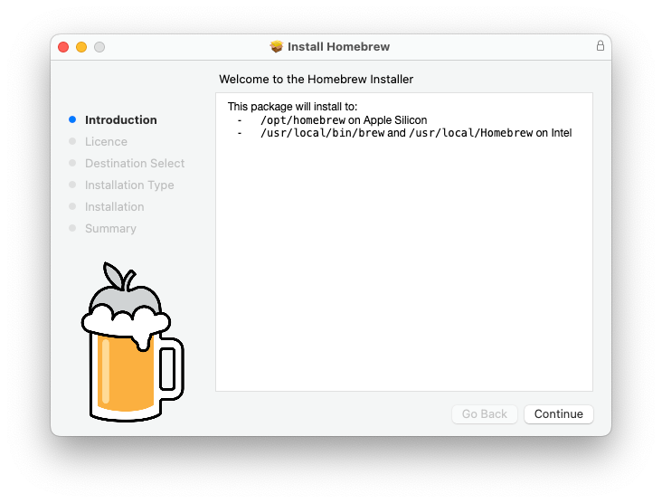

# Kubernetes Laboratory

Welcome to the Kubernetes Laboratory Setup Repository!

This repository is dedicated to creating a local Kubernetes cluster that serves as a fundamental infrastructure component for various projects. Additionally, it offers a streamlined approach to deploying essential tools within the cluster environment or via cloud deployments.

## Considerations

### Kubernetes Provider Comparison

When it comes to deploying a local Kubernetes cluster, there are several options available, each tailored to specific use cases and requirements. Here, we highlight two of the best options:

- **Minikube**: Widely regarded as the go-to tool for running Kubernetes environments locally, Minikube boasts robust features and cross-platform support (Linux, macOS, Windows). It offers compatibility with the latest Kubernetes releases as well as previous minor versions. Minikube can deploy as a virtual machine, a container, or on bare-metal, providing flexibility to suit various setups. With support for multiple container runtimes, advanced features like LoadBalancer and filesystem mounts, and a plethora of add-ons for installing Kubernetes applications, Minikube is a comprehensive solution for local Kubernetes development.

- **kind** (Kubernetes in Docker): Designed for simplicity and efficiency, kind allows users to run local Kubernetes clusters using Docker container "nodes." This lightweight tool is particularly well-suited for testing Kubernetes itself or for running clusters in continuous integration (CI) environments. With its straightforward setup and minimal resource requirements, kind is an ideal choice for developers who need to quickly set up and tear down Kubernetes clusters for testing purposes.

Considering our use case in a laboratory setting, where developers require fast and efficient Kubernetes cluster provisioning for testing purposes, our preferred solution is kind. Its simplicity, ease of use, and minimal overhead make it the optimal choice for our environment.

If one is using this for a more robust proof of concept change the variable `K8s_PROVIDER` on the `Makefile` to `minikube`.

### Kafka Helm Chart Comparison

When setting up Kafka on a Kubernetes cluster for testing purposes, selecting the right Helm chart depends on your specific needs. Considerations include additional components like Kafka Connect or Schema Registry, as well as community support and update frequency. Below is a comparison based on available sources:

#### Bitnami Kafka Helm Chart

- **Ease of Use:** Bitnami's Kafka Helm chart prioritizes simplicity and rapid deployment, making it ideal for developers seeking a straightforward setup without extensive customization.
- **Community and Updates:** Bitnami charts receive frequent updates and benefit from an active community, facilitating quick adaptation to new features or bug fixes.
- **Limited Features:** While easy to use, Bitnami's Kafka chart may lack certain features required for more complex testing scenarios, such as Kafka Connect, which isn't included by default.

#### Confluent Platform Helm Charts

- **Comprehensive Features:** Confluent Platform Helm charts offer a comprehensive solution, encompassing Kafka brokers, ZooKeeper, Kafka Connect, Schema Registry, and more. This is advantageous for users needing a complete Kafka ecosystem for testing.
- **Official Support:** As the official Helm charts for Confluent Platform, they are likely to be more stable and well-supported. However, it's worth noting that open-source Helm charts are not officially supported by Confluent.
- **Complexity:** Confluent Platform Helm charts tend to be more complex and may require additional configuration and customization. This could be a drawback for those seeking a quick and straightforward setup for testing purposes.

For straightforward testing scenarios or quick setups, the Bitnami Kafka Helm chart is recommended due to its ease of use and frequent updates. For the present, this will be the chosen option.

## Prerequisites

All work was done locally in macOS Sonoma and using either M1 or M2 processors. In order to use this repository locally one must have a Kubernetes Cluster running locally. This working solution was built using:

- [Podman](https://podman.io/)
- [Kind](https://kind.sigs.k8s.io/)

As for ease of deployment some tools are also required/suggested such as:

- [Kubernetes Command Line](https://kubernetes.io/docs/reference/kubectl/)
- [Helm](https://helm.sh/)

The dependencies are met using [Brew](https://brew.sh/) Bundle.

In terms of Helm Charts we will be using:

- [Bitnami Kafka Helm Chart](https://github.com/bitnami/charts/tree/main/bitnami/kafka)
- [Prometheus Community Helm Chart](https://github.com/prometheus-community/helm-charts/tree/main/charts/prometheus)
- [Grafana Official Helm Chart](https://github.com/grafana/helm-charts/tree/main/charts/grafana)

While detailed step-by-step instructions are provided, a Makefile has been included for simplified operation.

## Using Brew for Effortless Software Installation

Brew simplifies the process of obtaining commonly used tools without the need for constant admin rights requests. Here's how to set it up:

1. Download the [latest release of Homebrew from GitHub](https://github.com/Homebrew/brew/releases/latest).
1. Double-click the installer to begin the installation process and click "Continue."

    

1. Review the License Agreement, click "Continue," and then "Agree."

    

1. Review the storage space and location details, then click "Install."

    

1. To initialise the installation the Technology Support Analyst must enter the necessary credentials for an admin account.

    

### Installing Dependencies with Brew Bundle

Once Brew is installed, and assuming you have already cloned this repository, navigate to the directory containing the Brewfile and execute the following command:

```bash
$ brew bundle
Using helm
Using kind
Using kubernetes-cli
Using podman
Homebrew Bundle complete! 4 Brewfile dependencies now installed.
```

This command will automatically install all the dependencies listed in the Brewfile, ensuring that your environment is properly configured for working with this repository.

## Set up a local Kubernetes cluster environment

As previously indicated, our recommendation for local Kubernetes environments is to utilize Kind atop Podman. With all the necessary software installed, as outlined in the prerequisites section, users simply need to initiate a Podman instance and configure Kind using Podman as a provider.

### Setup Podman

To begin using Podman, you can create a new virtual machine running Docker using the podman machine command. Customize the machine's resources according to your needs, such as CPU cores, disk size, and memory. Here's an example:

```bash
podman machine init --cpus 4 --disk-size 100 --memory 12000 --rootful --volume $HOME:$HOME
```

> Make sure to review and adjust the values for CPU cores, disk size, and memory as required.

Once you've initialized the Podman machine, start it with the following command:

```bash
podman machine start
```

To verify that Podman is working correctly, you can run a test using the "hello-world" image:

```bash
podman container run hello-world
```

If everything is set up correctly, you should see a message confirming that Podman is up and running.

### Creating a Kind Cluster

With Podman running, we can utilise it as a provider to create a Kind cluster on top of it.

> Note: Kind should be able to auto-detect Podman. However, if you encounter any issues, you can use the environment variable `KIND_EXPERIMENTAL_PROVIDER=podman` to manually select the runtime.

To create the Kind cluster, we'll use the `kind-cluster.yaml` file, which contains the configuration for our cluster. To bootstrap the cluster, simply execute the following command from the same directory:

```bash
kind create cluster --config=kind-cluster.yaml
```

This command will use the specified configuration file to create and configure the Kind cluster according to your specifications.

### Creating a Minikube Cluster

With Podman running, we can utilise it as a provider to create a minikube cluster on top of it.

To create the minikube with some configurations needed for this use case, simply execute the following command:

```bash
minikube start --memory=max --cpus=max --disk-size=60g --ports=30000-30001:30000-30001,30860-30862:30860-30862 --driver=podman --container-runtime=cri-o --profile=k8s-local
```

## Kafka Deployment with Bitnami Helm Chart

This repository contains the configuration for deploying Kafka using the Bitnami Helm chart on a Kubernetes cluster. It includes settings for listeners, metrics, and external access.

The deployment is configured with the following settings:

- **Listeners**: Two listeners are configured, `client` and `external`, both using the `PLAINTEXT` protocol.
- **Metrics**: Kafka and JMX metrics are enabled.
- **External Access**: Enabled with NodePort service type, accessible via `localhost` on ports `30860`, `30861`, and `30862`.

Deploy Kafka using the provided `kafka.yaml` file.

```yaml
helm upgrade --install kafka -f kafka.yaml oci://registry-1.docker.io/bitnamicharts/kafka;
```

Kafka can be accessed by consumers via port `9092` on the following DNS name from within your cluster:

- `kafka.default.svc.cluster.local`

Each Kafka broker can be accessed by producers via port 9092 on the following DNS name(s) from within your cluster:

- `kafka-controller-0.kafka-controller-headless.default.svc.cluster.local:9092`
- `kafka-controller-1.kafka-controller-headless.default.svc.cluster.local:9092`
- `kafka-controller-2.kafka-controller-headless.default.svc.cluster.local:9092`

Kafka is exposed externally via NodePorts `30860`, `30861`, and `30862` on `localhost`.

## Prometheus Deployment with Prometheus Community Helm Chart

This repository contains the configuration for deploying Prometheus using the Prometheus community Helm chart on a Kubernetes cluster. It includes settings for disabling certain components and configuring external access.

The deployment is configured with the following settings:

- **Alertmanager**: Disabled.
- **Kube-state-metrics**: Disabled.
- **Prometheus Node Exporter**: Disabled.
- **Prometheus Pushgateway**: Disabled.
- **Scrape Configs**: Configured to scrape metrics from `kafka-exporter` at `kafka-metrics.default:9308`.
- **Server Service**: Exposed via NodePort on port `30001`.

If not already added, add the Prometheus community Helm repository to your Helm client.

```bash
helm repo add prometheus-community https://prometheus-community.github.io/helm-charts
helm repo update
```

Deploy Prometheus using the provided `prometheus.yaml` file.

```bash
helm upgrade --install promehteus -f prometheus.yaml prometheus-community/prometheus
```

Prometheus is exposed externally via NodePort on port `30001`. Access Prometheus by navigating to `http://localhost:30001` in your web browser.

## Grafana Deployment with Official Helm Chart

This repository contains the configuration for deploying Grafana using the official Grafana Helm chart on a Kubernetes cluster. It includes settings for the admin password, datasource configuration, and external access.

The deployment is configured with the following settings:

- **Admin Password**: Set to `admin`.
- **Datasources**: Configured to use Prometheus as the default datasource. Prometheus is accessed via a Kubernetes service URL.
- **Service**: Exposed via NodePort on port `30000`.

If not already added, add the Grafana official Helm repository to your Helm client.

```bash
helm repo add grafana https://grafana.github.io/helm-charts
helm repo update
```

Deploy Grafana using the provided `values.yaml` file.

```bash
helm install my-grafana grafana/grafana -f values.yaml
```

Grafana is exposed externally via NodePort on port `30000`. Access Grafana by navigating to `http://<node-ip>:30000` in your web browser.

## Makefile

To streamline the installation, configuration, and setup of various tools, we have included a `Makefile` in this repository. Before using the `Makefile`, ensure that `make` is available on your system. If you have Brew installed, you can install `make` by running:

```bash
brew install make
```

Additionally, `make` may already be installed on your system as part of Xcode. You can verify its availability by running the following command:

```bash
$ make --version
GNU Make 3.81
Copyright (C) 2006  Free Software Foundation, Inc.
This is free software; see the source for copying conditions.
There is NO warranty; not even for MERCHANTABILITY or FITNESS FOR A
PARTICULAR PURPOSE.

This program built for i386-apple-darwin11.3.0
```

Once `make` is installed and confirmed to be available, navigate to the directory containing the `Makefile`. You can then use the following commands:

- `make install_deps`: Installs dependencies listed in the Brewfile.
- `make setup_cluster`: Creates a Podman virtual machine and a Kind cluster.
- `stop_cluster`: Stop Podman and Minikube.
- `start_cluster`: Stop Podman and Minikube.
- `make deploy_kafka`: Deploys Kafka using Helm.
- `make deploy_prometheus`: Deploys Prometheus using Helm.
- `make deploy_grafana`: Deploys Grafana using Helm.
- `make all`: execute the above in a group.
- `make cleanup`: Stops and removes the Kind cluster and the Podman VM.

## Contributing

Contributions are welcome!

## License

This project is open source. See the LICENSE file for details.
